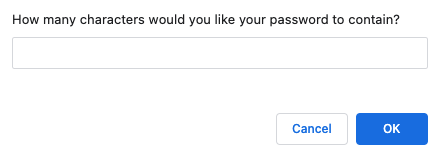
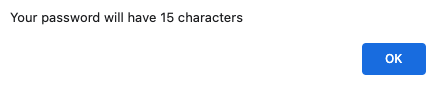
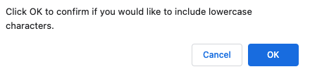
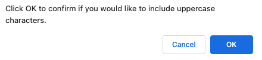
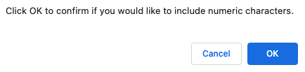
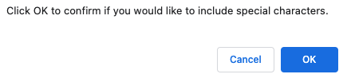
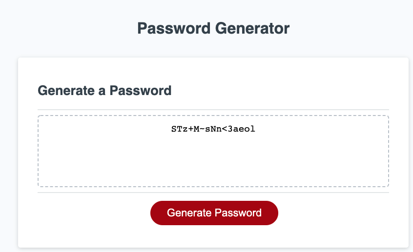

## Table of contents

- [HTML, CSS, js, and Git:](#html-css-js-and-git)
- [User Story](#user-story)
- [Description](#description)
- [Acceptance Criteria](#acceptance-criteria)
- [Mock-Up](#mock-up)
- [Popup Boxes](#popup-boxes)
- [Deployment](#deployment)
- [References](#references)

## HTML, CSS, js, and Git:
03 JavaScript: Password Generator

## User Story

```
AS AN employee with access to sensitive data
I WANT to randomly generate a password that meets certain criteria
SO THAT I can create a strong password that provides greater security
```

## Description
This homework assignment aims to generate a random password based on the user's criteria. First, the application validates the user input that at least one character type is selected. Then, after all, prompts are answered, the user will get the generated password that matches the prompt answers. 

## Acceptance Criteria

```
GIVEN I need a new, secure password
WHEN I click the button to generate a password
THEN I am presented with a series of prompts for password criteria
WHEN prompted for password criteria
THEN I select which criteria to include in the password
WHEN prompted for the length of the password
THEN I choose a length of at least 8 characters and no more than 128 characters
WHEN asked for character types to include in the password
THEN I confirm whether or not to include lowercase, uppercase, numeric, and/or special characters
WHEN I answer each prompt
THEN my input should be validated and at least one character type should be selected
WHEN all prompts are answered
THEN a password is generated that matches the selected criteria
WHEN the password is generated
THEN the password is either displayed in an alert or written to the page
```

## Mock-Up

The following image shows the web application's appearance and functionality:


## Popup Boxes
- This will send the user the series of prompts to confirm.

Number of characters


Confirming the length of password


Confirming the lowercase character


Confirming the uppercase character


Confirming the numerical value


Confirming the special character


Generated Password



## Deployment
Two options are provided the first one is link and second one thats click me that will redirect to the page
- Application deployed to [Github](https://github.com/) : 
  - https://github.com/dparmar32/password-generator
  - [Click Here](https://github.com/dparmar32/password-generator)
- Application live GitHub URL submitted link : 
  - https://dparmar32.github.io/password-generator/
  - [Click Here](https://dparmar32.github.io/password-generator/)

## References
- [Password Special Character](https://owasp.org/www-community/password-special-characters)
- [JavaScript](https://developer.mozilla.org/en-US/docs/Web/JavaScript/Guide/Introduction)


- - -
© 2021 Trilogy Education Services, LLC, a 2U, Inc. brand. Confidential and Proprietary. All Rights Reserved.
